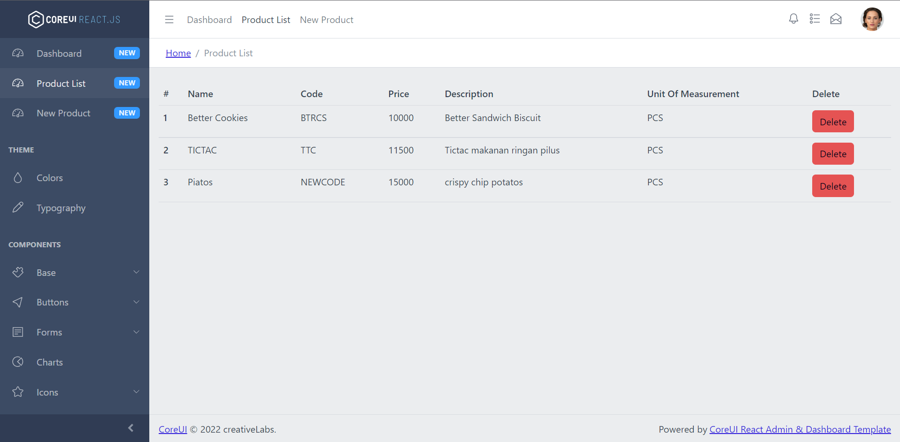
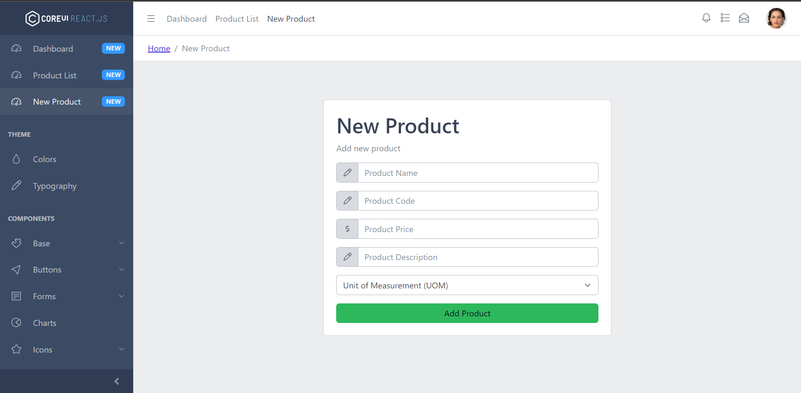

# Impack CRUD Website

Simple CRUD website created using CoreUI Free React Admin Template v4

## Quick Start


- Clone the repo: `git clone https://github.com/Lukmandst/impact-website.git`

### Installation

``` bash
$ npm install
```

or

``` bash
$ yarn install
```


Add .env file at root folder project, and add following

```sh
PORT=3000
CHOKIDAR_USEPOLLING=true
REACT_APP_API=https://impack-api.herokuapp.com
```

### Basic usage

``` bash
# dev server with hot reload at http://localhost:3000
$ npm start 
```

or 

``` bash
# dev server with hot reload at http://localhost:3000
$ yarn start
```

Navigate to [http://localhost:3000](http://localhost:3000). The app will automatically reload if you change any of the source files.

#### Build

Run `build` to build the project. The build artifacts will be stored in the `build/` directory.

```bash
# build for production with minification
$ npm run build
```

or

```bash
# build for production with minification
$ yarn build
```
### Preview

<div style="display:flex, flex-direction: column" >





</div>

## Copyright and License

copyright 2022 creativeLabs Łukasz Holeczek.   

 
Code released under [the MIT license](https://github.com/coreui/coreui-free-react-admin-template/blob/master/LICENSE).
There is only one limitation you can't can’t re-distribute the CoreUI as stock. You can’t do this if you modify the CoreUI. In past we faced some problems with persons who tried to sell CoreUI based templates.

